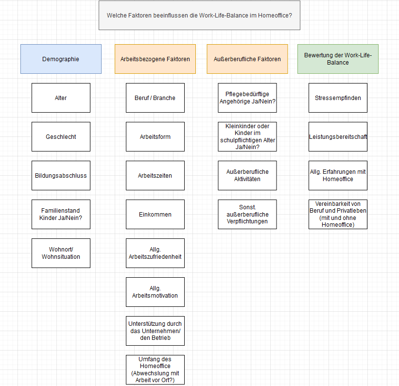

```{r setup, include=FALSE}
knitr::opts_chunk$set(echo = TRUE)
```

# Work-Life-Balance im Homeoffice

## Forschungsfrage
Welche Faktoren beeinflussen die Work-Life-Balance im Homeoffice?

## Quellen

siehe Ordner "Quellen"

## Faktorenraum


## Operationalisierung "Work-Life-Balance"

* **Stressempfinden** _verschiedene Items_ Statements, Likert-Skala (Thema: Stress im (Arbeits-)Alltag, Bsp.: "Im Homeoffice bereitet mir meine Arbeit weniger Stress")

* **Beurteilung der beruflichen Leistung** _(Selbst-)Beurteilung mittels Likert-Skala, Bsp.:_ [siehe hier](https://zis.gesis.org/skala/Danner-Skala-zur-Beurteilung-beruflicher-Leistung)  

* **Allgemeine Erfahrungen mit Homeoffice** _verschiedene Items_ Statements, Likert-Skala (Themen: Vergleich zwischen Homeoffice und Arbeit vor Ort, allgemeine Veränderungen im Arbeitsalltag, Bsp.: "Ich bin im Homeoffice motivierter und konzentrierter bei der Arbeit") 

* **Vereinbarkeit von Beruf und Privatleben** _verschiedene Items_ Statements, Likert-Skala (Themen: Familie, Kinder, Care-Arbeit, Hobbys und außerberufliche Aktivitäten, sonstige Verpflichtungen, Bsp.:"Durch den Wegfall des Pendelns zur Arbeit habe ich mehr Zeit für meine Familie/ für außerberufliche Aktivitäten")

### Zur Operationalisierung
Der Begriff _Work-Life-Balance_ beschreibt das Verhältnis zwischen Arbeits- und Privatleben. Von einer guten Work-Life-Balance spricht man, wenn ein harmonisches Gleichgewicht aus Berufs- und Privatleben existiert. Diese Definition lässt sich durch unterschiedliche Faktoren begreifen. Besonders wichtig bei der Operationalisierung von Work-Life-Balance ist das persönliche Empfinden von **Stress**, die Beurteilung der eigenen **Arbeitsleistung**, die **Auswirkungen auf die Arbeit** sowie die **Auswirkungen auf Außerberufliches** (Familie/Haushalt, außerberufliche Verpflichtungen/Aktivitäten, Selbst). Um diese Faktoren messbar zu machen, ist es sinnvoll, die Probanden bestimmte Statements zu den jeweiligen Faktoren vorzugeben und sie diese über Likert-Skalen beurteilen zu lassen.
